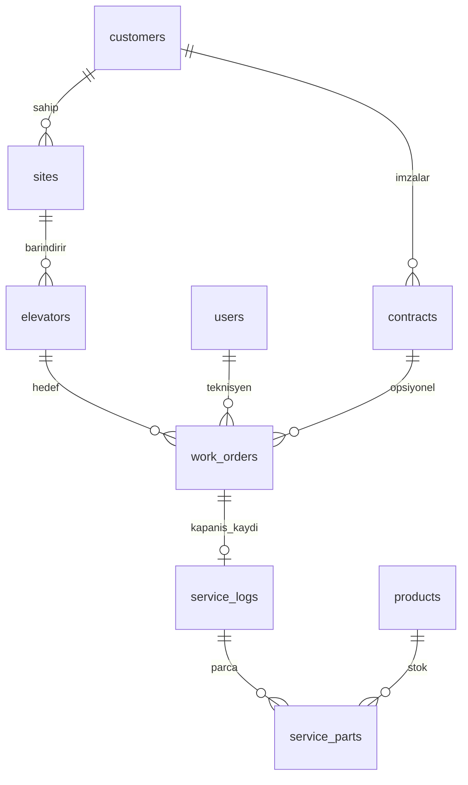

# Asansor Firmasi — Yol Haritasi

Bu dokuman Lift projesinin **nerede oldugunu** ve **sirada ne oldugunu** tek yerde toplar.

---

## 1 dakikada ozet

```
TAMAM     Auth, Musteri, Tesis, Asansor, Kategori, Urun, Stok, MinIO, Soft delete
          Is emri, Servis kaydi, Parca tuketimi, Sozlesmeler
SIRADA    Roller / yetki  ← teknisyen vs ofis ayrimi
```

Asansor firmasi icin saha ziyareti modulu tamamlandi. Simdi rol/yetki ayrimi (Faz 8) sirada.

---

## Tamamlanan moduller

| Modul | Ne ise yarar | Dokuman |
|-------|--------------|---------|
| Auth | Giris, oturum, kullanici | [AUTH.md](./AUTH.md) |
| Customers | Bireysel / kurumsal musteri | [CUSTOMERS.md](./CUSTOMERS.md) |
| Sites | Musteri tesis / bina | [SITES.md](./SITES.md) |
| Elevators | Tesis asansor / cihaz | [ELEVATORS.md](./ELEVATORS.md) |
| Categories | Urun gruplari | [CATEGORIES.md](./CATEGORIES.md) |
| Products | Parca katalogu + fotograf | [PRODUCTS.md](./PRODUCTS.md) |
| Stock | Stok giris / cikis / duzeltme | [STOCK.md](./STOCK.md) |
| MinIO | Dosya depolama | [STORAGE.md](./STORAGE.md) |
| Work Orders | Saha is emri planlama | [WORK_ORDERS.md](./WORK_ORDERS.md) |
| Service Logs | Teknisyen servis kaydi | [SERVICE_LOGS.md](./SERVICE_LOGS.md) |
| Service Parts | Parca tuketimi + stok entegrasyonu | [SERVICE_PARTS.md](./SERVICE_PARTS.md) |
| Contracts | Bakim / hizmet sozlesmeleri | [CONTRACTS.md](./CONTRACTS.md) |

**Capraz kural (TAMAM):** Tum is modullerinde silme = **soft delete** (`deleted_at`). Hard delete yok.

**Endpoint yapisi (oturmus desen):**
```
/customers/:id/sites/:siteId/elevators/:elevatorId
```

---

## Sirada ne var? (oncelik sirasi)

| Sira | Faz | Modul | Durum | Neden simdi? |
|------|-----|-------|-------|--------------|
| — | 1 | Musteriler | TAMAM | — |
| — | 2 | Tesisler | TAMAM | — |
| — | 3 | Asansorler | TAMAM | — |
| **4** | **4** | **Is emirleri** | **TAMAM** | — |
| **5** | **5** | **Servis kayitlari** | **TAMAM** | — |
| 6 | 6 | Parca tuketimi | TAMAM | Stok entegrasyonu |
| 7 | 7 | Sozlesmeler | TAMAM | Is emrine opsiyonel baglanti |
| 8 | 8 | Roller / yetki | **SIRADA** | Teknisyen vs ofis ayrimi |

**Sonraki kodlama adimi:** Faz 8 (Roller / yetki).

---

## Buyuk resim — Veri modeli



**Okuma zinciri:** Musteri → Tesis → Asansor → Is emri → Servis kaydi → Parca

Kalın cizgiler = siradaki fazlar. Kesikli `contracts` = Faz 7, simdilik opsiyonel.

---

## Firma gercekte ne tutar? (7 adim)

| # | Soru | Modul | Durum |
|---|------|-------|-------|
| 1 | Kim musterim? | Customers | TAMAM |
| 2 | Nerede hizmet veriyorum? | Sites | TAMAM |
| 3 | Orada hangi asansorler var? | Elevators | TAMAM |
| 4 | Ne zaman / kime gidilecek? | Work Orders | TAMAM |
| 5 | Gidince ne yaptik? | Service Logs | TAMAM |
| 6 | Hangi parcayi kullandik? | Service Parts | TAMAM |
| 7 | Ne sozlesmem var? | Contracts | TAMAM |

4–5 olmadan "musteri listesi" saha operasyonunu cozmez.

---

## Notlar nereye yazilir?

Kafan karismasin diye ayri tutuluyor:

| Not turu | Nereye | Ornek |
|----------|--------|-------|
| Asansor hakkinda sabit bilgi | `elevators.notes` | "2020'de monte edildi" |
| Tesis / musteri genel not | `sites.notes`, `customers.notes` | "Giris B2'den" |
| Ofis planlama notu | `work_orders.internalNotes` | "Anahtar guvenlikte" |
| Sahada yapilan is | `service_logs.workPerformed` | "Halat kontrol edildi" |
| Sonraki sefer icin uyari | `service_logs.followUpNotes` | "6 ay sonra halat tekrar bak" |

**Kural:** Ziyaret gecmisi asansor `notes` alanina yazilmaz; her ziyaret ayri `service_logs` satiri olur.

---

## Faz detaylari

### Faz 1 — Musteriler — TAMAM

- Bireysel / kurumsal kayit, TC / vergi no tekilligi
- CRUD, arama, sayfalama, soft delete
- Detay: [CUSTOMERS.md](./CUSTOMERS.md)

---

### Faz 2 — Tesisler — TAMAM

- Musteri altinda: `/customers/:id/sites`
- Adres, il, ilce, yetkili kisi
- Tesis silinince bagli asansorler soft delete
- Detay: [SITES.md](./SITES.md)

---

### Faz 3 — Asansorler — TAMAM

- Tesis altinda: `/customers/:id/sites/:siteId/elevators`
- Marka, model, seri no, kapasite, durum (`active` / `inactive` / `faulty`)
- Detay: [ELEVATORS.md](./ELEVATORS.md)

---

### Faz 4 — Is emirleri (Work Orders) — TAMAM

**Ne ise yarar:** Planlanan veya acil saha isi. Ofis "yarin su asansore gidilecek" der; teknisyen atar.

Detay: [WORK_ORDERS.md](./WORK_ORDERS.md)

---

### Faz 5 — Servis kayitlari (Service Logs) — TAMAM

**Ne ise yarar:** Teknisyen gittikten sonra **ne yapti** kaydi. Is emri kapanirken doldurulur.

Detay: [SERVICE_LOGS.md](./SERVICE_LOGS.md)

---

### Faz 6 — Parca tuketimi — TAMAM

**Ne ise yarar:** Ziyarette kullanilan parca stoktan dusulur.

Detay: [SERVICE_PARTS.md](./SERVICE_PARTS.md)

---

### Faz 7 — Sozlesmeler — TAMAM

**Ne ise yarar:** Periyodik bakim anlasmasi, ziyaret sikligi, sozlesme suresi.

Detay: [CONTRACTS.md](./CONTRACTS.md)

---

### Faz 8 — Roller / yetki — Bekliyor

| Rol | Ne yapar |
|-----|----------|
| Admin | Her sey |
| Ofis | Musteri, is emri planlar |
| Teknisyen | Atanan isleri gorur, servis kaydi girer |
| Depo | Stok giris/cikis |

---

## Hedef senaryo (Faz 4–6 tamamlaninca)

> Ofis, Kadikoy A Blok asansorune periyodik bakim is emri acar, teknisyene atar.  
> Teknisyen mobilde isi gorur, `in_progress` yapar, gidip bakimi yapar.  
> Kapatirken: "Halat kontrol edildi, kapi sensoru degisti" yazar.  
> `followUpNotes`: "6 ay sonra halat tekrar kontrol".  
> Kapı sensoru stoktan 1 adet dusulur.  
> Ofis asansor gecmisine bakinca: ne zaman, kim, ne yapti gorur.

---

## Simdi ne yapmalisin?

**Hemen sonraki adim: Faz 8 (Roller / yetki)**

1. Kullanici rol alani (`admin`, `office`, `technician`, `warehouse`)
2. Route bazli yetki kontrolu
3. Teknisyen sadece atanan isleri gorsun

Detay asagida Faz 8 bolumunde.

---

## Her yeni modulde tekrarlayan desen

```
1. src/constants/xxx.constants.ts
2. src/database/schema/xxx.ts
3. drizzle migration
4. src/dtos/xxx.dto.ts
5. src/types/xxx.types.ts
6. src/services/xxx.service.ts
7. src/controllers/xxx.controller.ts
8. src/routes/xxx.routes.ts
9. docs/XXX.md
```

Kurallar:
- Tum endpoint'ler `authGuard` arkasinda
- Liste: sayfalama + arama + filtre
- Soft delete (`deleted_at`)
- Swagger tag ekle

---

## Bilincli olarak sonraya birakilanlar

- Fatura / tahsilat
- Teklif modulu
- TSE / periyodik muayene takvimi
- Push bildirim / SMS hatirlatma
- GPS teknisyen konumu
- Musteri portali (musteri kendi gecmisini gorsun)
- Checklist sablonlari (ilk surumde serbest metin yeterli)

---

## Ilgili dokumanlar

| Dosya | Konu |
|-------|------|
| [README.md](./README.md) | Dokuman indeksi |
| [CUSTOMERS.md](./CUSTOMERS.md) | Musteri |
| [SITES.md](./SITES.md) | Tesis |
| [ELEVATORS.md](./ELEVATORS.md) | Asansor |
| [PRODUCTS.md](./PRODUCTS.md) | Parca katalogu |
| [STOCK.md](./STOCK.md) | Stok |
| [WORK_ORDERS.md](./WORK_ORDERS.md) | Is emirleri |
| [SERVICE_LOGS.md](./SERVICE_LOGS.md) | Servis kayitlari |
| [SERVICE_PARTS.md](./SERVICE_PARTS.md) | Parca tuketimi |
| [CONTRACTS.md](./CONTRACTS.md) | Sozlesmeler |
